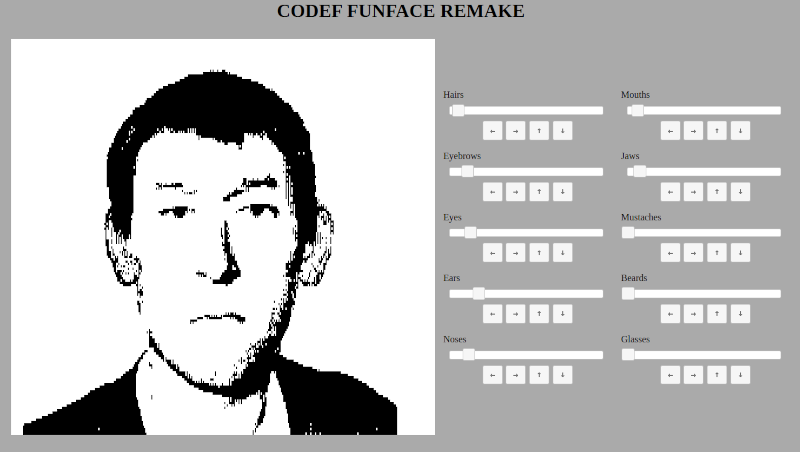

# CODEF_Funface
A CODEF remake of Funface ( Mac / Atari ST / Amiga ) coded using [CODEF](https://codef.santo.fr)

For your information, this tool was used by scotland yard, and other police and intelligence organisations during the 80's

## Usage
Too easy to Use ;)

## Some work done with it

## Try it Live
[HERE](https://n0namen0.github.io/CODEF_Funface/)

## License
[MIT](https://choosealicense.com/licenses/mit/)
